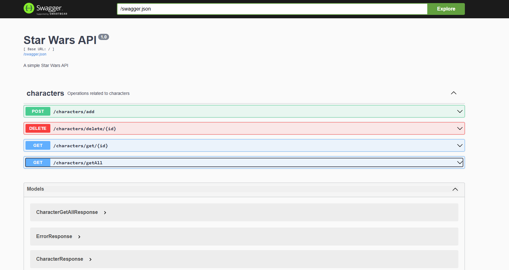
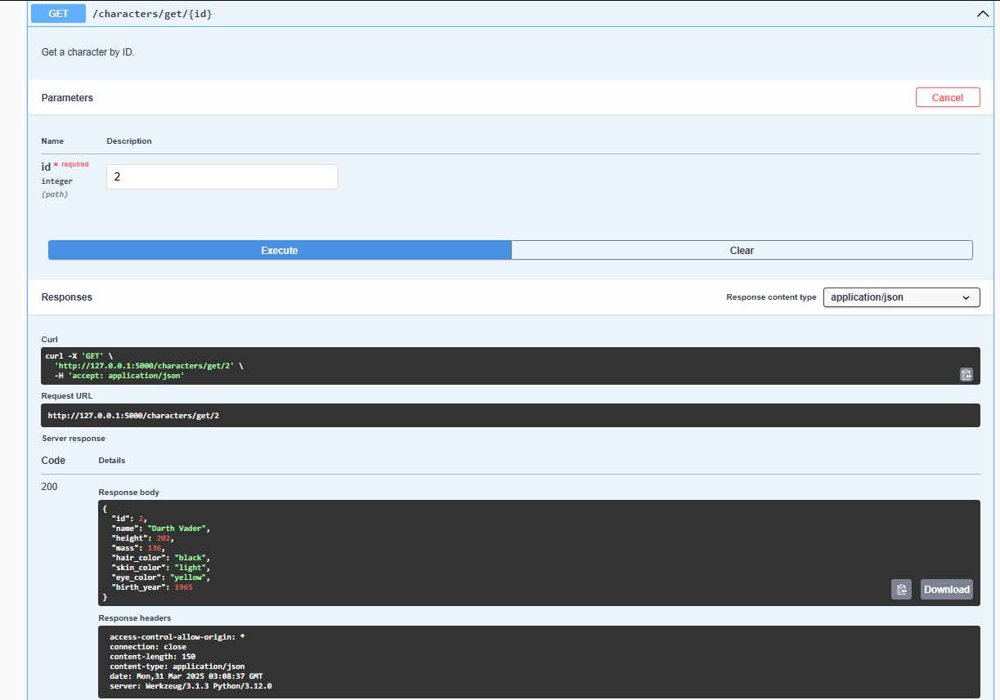

# Star Wars API

## Description
This is an API project to manage characters from the Star Wars universe. It is designed modularly to facilitate scalability and maintenance. The application allows interaction with the database to create, read, update, and delete (CRUD).

## Project Structure

The project follows a modular organization to improve maintainability and scalability.

```
star_wars_api/
├── .postman/                 # Postman collection
├── app/
│   ├── db/                   # Database connection management
│   ├── modules/              # Modular organization of the application
│   │   ├── characters/       # Characters module
│   │   │   ├── controllers/  # Controllers managing HTTP requests
│   │   │   │   └── utils/    # Utilities for controllers
│   │   │   ├── models/       # Character schema definition
│   │   │   ├── repositories/ # Database or external API access
│   │   │   └── services/     # Business logic for the module
│   ├── utils/                # General utilities for the project
│   │   ├── controller_loader.py  # Dynamic controller loading
│   │   └── register_namespace.py # Dynamic API namespace registration
│   ├── __init__.py           # Initializes the Flask application
│   └── routes.py             # API route configuration and registration
└── run.py                    # Main entry point to run the application
```

## Installation

### Prerequisites

- Python 3.x
- Docker (optional)

### Local Installation

1. **Clone the repository**

   Clone the repository from GitHub:

   ```
   git clone https://github.com/CNoctis/star_wars_api.git
   cd star_wars_api
   ```

2. **Create a virtual environment**

   Create a virtual environment with the following command:

   ```
   python -m venv env
   ```

3. **Activate the virtual environment**

   - On Windows:

     ```
     .\env\Scripts\activate
     ```

   - On macOS/Linux:

     ```
     source env/bin/activate
     ```

4. **Install dependencies**

   Once inside the virtual environment, install the required dependencies with pip:

   ```
   pip install -r requirements.txt
   ```

5. **Run the application**

   You can run the application with the following command:

   ```
   python run.py
   ```

   The API will be available at `http://127.0.0.1:5000`.

### Installation using Docker

If you prefer to use Docker to run the application, you can follow these steps:

1. **Build and run the Docker image**

   Use Docker Compose to build and run the image:

   ```
   docker-compose up --build
   ```

   This will create the image and run the application. The API will be available at `http://localhost:5000`.

## Swagger UI

The API documentation is available through Swagger UI. You can access it at:

```
http://localhost:5000/docs
```

Here you can see all the API endpoints and test them directly from the browser.

## Available Endpoints

Below is a list of the available endpoints in the API:



- **GET /characters/getAll**: Retrieves all characters. 
- **GET /characters/get/{id}**: Retrieves a character by ID. 
- **POST /characters/add**: Creates a new character.  
- **DELETE /characters/delete/{id}**: Deletes a character by ID. 

Refer to the Swagger section for more details on how to use each endpoint.

## Docker Container Security

This project has been configured to ensure that it has no known vulnerabilities.


